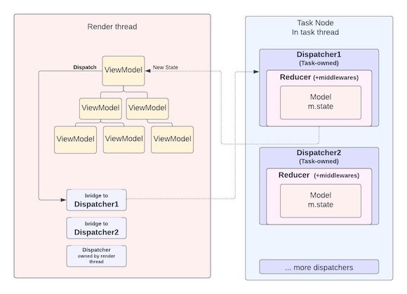

# Cross-Thread MVI Pattern

← [README.md](../README.md#-learn-more)

## Overview

The Cross-Thread MVI pattern enables thread-safe state management across render and task threads. The pattern consists of three core components: **Model** (state container), **Reducer** (state transformation logic), and **Dispatcher** (thread-safe communication bridge).



## Core Components

### Model

The Model holds application state. It extends the `Model` base class and defines the initial state structure.

```brightscript
class CounterModel extends Model
    state = {
        count: 0,
        lastUpdated: invalid
    }
end class
```

### Reducer

The Reducer transforms state in response to Intents. It consists of two parts: **middleware** (for async operations) and **reducer function** (for state updates).

```brightscript
class CounterReducer extends Reducer

    ' Middleware runs before reducer - useful for async operations
    override function applyMiddlewares()
        return [

            ' Logger middleware
            function(intent, state) as Intent
                ' Log
                return intent ' NEXT
            end function,

            function(intent, state) as Intent
                if intent.type = "LOAD_COUNT"
                    ' Async operation
                    return invalid  ' Stop reducer execution
                end if

                return intent ' NEXT
            end function
        ]
    end function

    ' Reducer updates state based on intent
    override function reducer(state, intent)
        if intent.type = "INCREMENT"
            state.count = state.count + 1
            state.lastUpdated = createObject("roDateTime").toISOString()
        else if intent.type = "COUNT_LOADED"
            state.count = intent.payload.value
            state.lastUpdated = createObject("roDateTime").toISOString()
        end if

        return state
    end function
end class
```

### Dispatcher

The Dispatcher connects Model and Reducer, providing thread-safe communication through three key methods:

#### createDispatcher

Creates a dispatcher instance on the task thread:

```brightscript
' Initialization

model = new Models.CounterModel()
reducer = new Reducers.CounterReducer()

' Register dispatcher with name, model, and reducer (name is globally unique)
Rotor.createDispatcher("counter", model, reducer)

```

#### dispatch

Sends intents to trigger state changes. Can be called from any thread:

```brightscript
dispatcher = m.getDispatcher("counter")

' Dispatch intent
dispatcher.dispatch({
    type: "INCREMENT",
    payload: { foo: "bar" }
})
```

#### getState

Retrieves current state. Executes callback with current state:

```brightscript
' Get state once
m.dispatcher.getState(sub(props, state)
    props.count = state.count
    props.lastUpdated = state.lastUpdated
end sub)
```

#### addListener

Subscribes to state changes. Listener fires whenever state updates:

```brightscript
' Listen for state changes
m.dispatcher.addListener({
    ' Optional: Map state to local props
    mapStateToProps: sub(props, state)
        props.count = state.count
    end sub,

    ' Optional: filter when to trigger callback
    allowUpdate: sub(state)
        return state.count > 0
    end sub,

    ' Optional: Callback when state changes
    callback: sub()
        return state.count > 0
    end sub,

    ' Optional: CallbackWithState when state changes
    callback: sub(state)
        return state.count > 0
    end sub,

    ' Optional: remove after first trigger
    once: false
})
```

## Complete Example

### Task Thread Setup

```brightscript
sub taskFunction()
    ' Create model and reducer
    counterModel = new Models.CounterModel()
    counterReducer = new Reducers.CounterReducer()

    ' Create dispatcher
    Rotor.createDispatcher("counter", counterModel, counterReducer)

    ' Start sync
    m.appFw.sync()
end sub
```

### Render Thread Usage

```brightscript
namespace ViewModels
    class CounterView extends ViewModel

        override sub onCreateView()
            m.dispatcher = m.getDispatcher("counter")

            ' Get initial state
            m.dispatcher.getState(sub(props, state)
                props.count = state.count
            end sub)

            ' Listen for changes
            m.dispatcher.addListener({
                mapStateToProps: sub(props, state)
                    props.count = state.count
                end sub,
                callback: m.updateCounter
            })
        end sub

        override function template() as object
            return {
                nodeType: "Label",
                id: "counterLabel",
                fields: {
                    text: `Count: ${m.props.count}`
                }
            }
        end function

        sub updateCounter()
            ' Re-render on state change
            m.render({
                id: "counterLabel",
                fields: {
                    text: `Count: ${m.props.count}`
                }
            })
        end sub

        sub onIncrementPress()
            ' Dispatch intent
            m.dispatcher.dispatch({
                type: "INCREMENT"
            })
        end sub
    end class
end namespace
```

## Thread Flow

```
[Render Thread]           [Task Thread]
     |                         |
     | dispatch(intent)        |
     |------------------------>|
     |                         | middleware
     |                         | reducer
     |                         | state update
     | listener callback       |
     |<------------------------|
     | UI update               |
```

## Dispatcher Accessibility

### Task Thread Dispatchers

Dispatchers created in a task thread using `Rotor.createDispatcher()` are globally accessible:
- Accessible from the render thread via `m.getDispatcher(name)`
- Accessible from any other task thread via `m.getDispatcher(name)`
- Enable true cross-thread communication and state synchronization

### Render Thread Dispatchers

Dispatchers can also be created in the render thread using the exactly same pattern (Model + Reducer + createDispatcher):

```brightscript
' In render thread - for complex component internal state
class MyViewModel extends viewModel
    override sub onCreateView()
        model = new Models.ComponentStateModel()
        reducer = new Reducers.ComponentStateReducer()

        ' Create dispatcher
        Rotor.createDispatcher("localComponent", model, reducer)
    end sub
    ...
end class
```

**Important**: Render thread dispatchers are technically accessible from task threads (via the same dispatcher pattern), but this is **rarely recommended**. The standard pattern is task thread dispatchers accessed by render thread, not the reverse.

Use render thread owned dispatchers for:
- Complex component internal state management
- Cross-component UI state coordination
- Local UI state that never needs task thread processing

## Key Principles

### State Mutations in Task Thread

All state changes occur in the task thread through the reducer. The render thread never modifies state directly.

### Middleware for Async Operations

Use middleware for API calls, timers, or complex logic. Return `invalid` to prevent reducer execution, or return the intent to continue.

### Listeners for UI Updates

Use listeners to react to state changes. Filter updates with `allowUpdate` for efficiency.

### Single Source of Truth

Each dispatcher maintains one model as the single source of truth for its domain. Multiple components can subscribe to the same dispatcher.

## Best Practices

- Keep models focused on specific domains (e.g., user, content, settings)
- Use clear, descriptive intent types
- Filter listener updates with `allowUpdate` when needed
- Remove listeners with `once: true` for one-time operations
- Handle all state mutations in the reducer, never in middleware


---

## 📚 Learn More

**[ViewBuilder Overview](./view-builder-overview.md)**

**Reference Documentation:**
- [ViewBuilder Overview](./view-builder-overview.md) - High-level architecture and concepts
- [Widget Reference](./view-builder-widget-reference.md) - Complete Widget properties, methods, and usage patterns
- [ViewModel Reference](./view-builder-viewmodel-reference.md) - Complete ViewModel structure, lifecycle, and state management

**Plugin Documentation:**
- [Fields Plugin](./view-builder-fields-plugin.md) - Field management with expressions and interpolation
- [FontStyle Plugin](./view-builder-fontstyle-plugin.md) - Typography and font styling
- [Observer Plugin](./view-builder-observer-plugin.md) - Field observation patterns
- [Focus Plugin](./view-builder-focus-plugin.md) - Focus management and navigation

**Additional Documentation:**
- [Internationalization support](./i18n-support.md) - Locale-aware interface implementation
