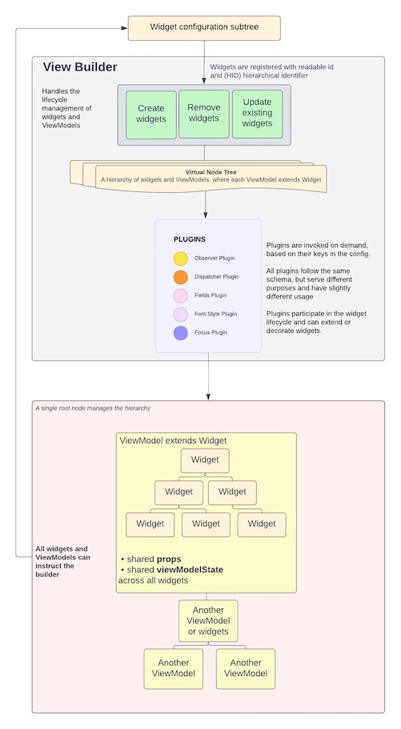

# ViewBuilder Overview

[← README.md](../README.md#-learn-more) | [🌱](./ai/view-builder-overview.opt.yaml)

The Rotor ViewBuilder provides a declarative way to build Roku SceneGraph UIs entirely from BrightScript code—without XML. This document provides a high-level overview of the ViewBuilder architecture and its core concepts.

---

## Architecture

The ViewBuilder system consists of three main layers:
## Core Engine (Under-the-hood insight)

### 1. View Builder 

The View Builder is responsible for the complete lifecycle management of widgets and ViewModels:

- **Create widgets** - Instantiate and configure new UI components
- **Remove widgets** - Clean up and destroy components
- **Update widgets** - Modify existing component properties

All widgets are registered with a unique identifier and organized in a **Hierarchical Identifier (HID)** system that tracks the widget tree structure.

### 2. Virtual Node Tree

The Virtual Node Tree is an abstraction layer that represents the entire UI hierarchy:

- Maintains a hierarchy of widgets and ViewModels
- Each ViewModel extends Widget and can contain multiple child widgets
- Provides efficient lookup and navigation through the widget tree
- Manages parent-child relationships automatically

### 3. Plugins

Plugins extend widget functionality and are invoked on-demand based on configuration:

- **Observer Plugin** - Field observation and change callbacks
- **Dispatcher Plugin** - State management integration
- **Fields Plugin** - Dynamic field expressions and interpolation
- **Font Style Plugin** - Typography and font configuration
- **Focus Plugin** - Spatial navigation and focus management

All plugins follow the same lifecycle hooks (beforeMount, beforeUpdate, beforeDestroy) and can extend or decorate widgets with additional capabilities.

---

## Core Concepts

### Widget

A **Widget** is the smallest unit in the UI tree, representing a single SceneGraph node.

- Configured through declarative object properties
- Can have child widgets
- Supports all plugin extensions
- Automatically receives framework methods for navigation and state management

[Learn more about Widgets →](./view-builder-widget-reference.md)

### ViewModel

A **ViewModel** extends Widget to group multiple widgets with shared state and behavior:

- **Shared `props`** - Read-only configuration accessible to all child widgets
- **Shared `viewModelState`** - Mutable state accessible to all child widgets
- **Template method** - Returns the widget tree configuration
- **Lifecycle hooks** - onCreateView, onTemplateCreated, onUpdateView, onDestroyView

All widgets within a ViewModel can access the same `props` and `viewModelState` references, enabling coordinated UI updates without prop drilling.

[Learn more about ViewModels →](./view-builder-viewmodel-reference.md)

---

## How It Works

1. **Widget Registration** - Widgets are created and added to the Virtual Node Tree with unique HIDs
2. **Plugin Decoration** - Based on configuration, plugins extend widgets with additional functionality
3. **Hierarchy Building** - Parent-child relationships are established in the virtual tree
4. **SceneGraph Rendering** - Virtual widgets are materialized as actual SceneGraph nodes
5. **Lifecycle Management** - Framework manages mount, update, and destroy operations automatically

The Virtual Node Tree acts as a single source of truth, allowing the framework to efficiently track changes and update only the necessary SceneGraph nodes.

---

## Key Benefits

- **No XML Required** - Build entire UIs in BrightScript with full IDE support
- **Declarative API** - Describe what you want, not how to build it
- **Automatic Lifecycle** - Framework handles mounting, updating, and cleanup
- **Plugin Architecture** - Extend functionality without modifying core code
- **Virtual Tree Abstraction** - Efficient updates and lookups
- **Shared State** - ViewModels provide scoped state sharing without prop drilling

---

## 📚 Learn More

**NEXT STEP: [Widget Reference](./view-builder-widget-reference.md)**

**Reference Documentation:**
- [Framework Initialization](./framework-initialization.md) - Configuration, task synchronization, and lifecycle
- [Widget Reference](./view-builder-widget-reference.md) - Complete Widget properties, methods, and usage patterns
- [ViewModel Reference](./view-builder-viewmodel-reference.md) - Complete ViewModel structure, lifecycle, and state management

**Plugin Documentation:**
- [Fields Plugin](./view-builder-fields-plugin.md) - Field management with expressions and interpolation
- [FontStyle Plugin](./view-builder-fontstyle-plugin.md) - Typography and font styling
- [Observer Plugin](./view-builder-observer-plugin.md) - Field observation patterns
- [Focus Plugin](./view-builder-focus-plugin.md) - Focus management and navigation

**Additional Documentation:**
- [Cross-Thread MVI design pattern](./cross-thread-mvi.md) - State management across threads
- [Internationalization support](./i18n-support.md) - Locale-aware interface implementation
